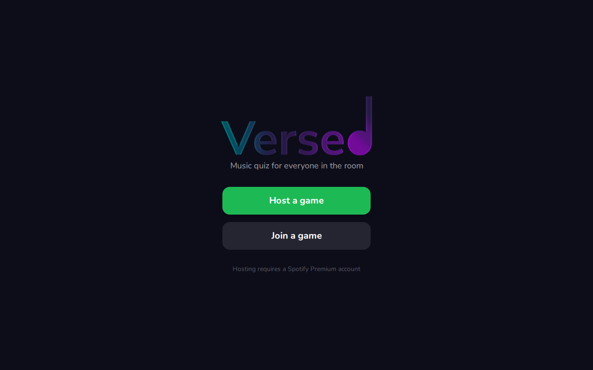
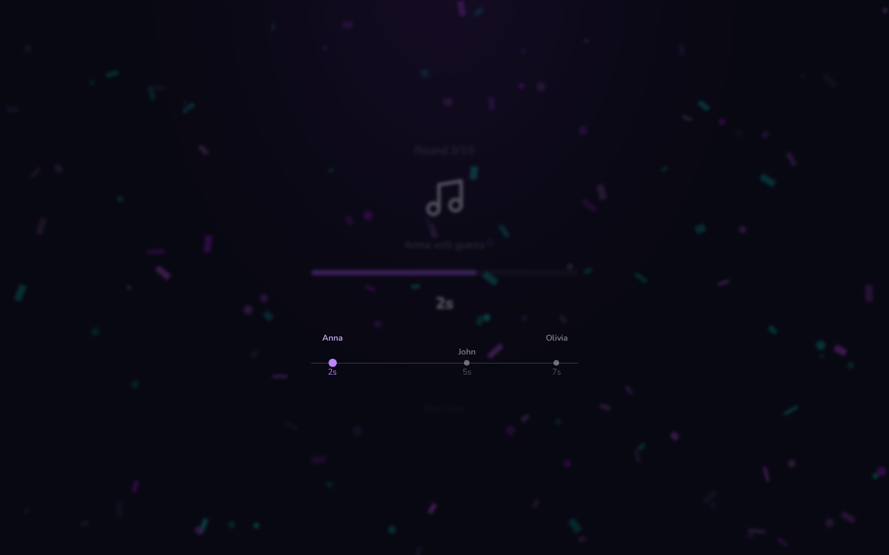
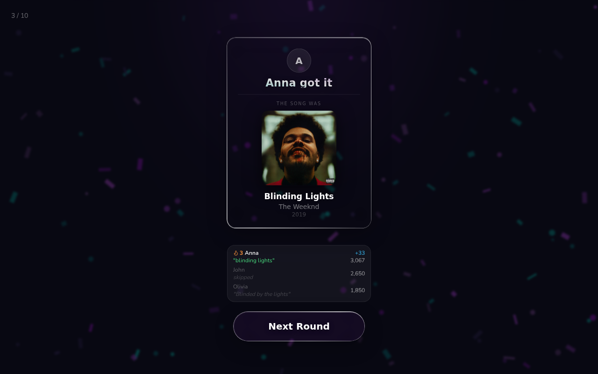

<p align="center">
  
</p>

<p align="center">
  <strong>Real-time multiplayer music quiz where you bid how few seconds you need to name a song.</strong>
</p>

<p align="center">
  <a href="https://joavn.dev/versed">Play</a>
  &nbsp;·&nbsp;
  <a href="https://github.com/JoachimVN/Versed/issues">Issues</a>
  &nbsp;·&nbsp;
  <a href="https://github.com/JoachimVN/Versed/pulls">Pull Requests</a>
</p>

<p align="center">
  
  
</p>

---

## Screenshots

<p align="center">
  
  <br>
  <em>Home screen</em>
</p>

<p align="center">
  
  <br>
  <em>Song playing, from the host's view</em>
</p>

<p align="center">
  
  <br>
  <em>Song Reveal</em>
</p>

---

## How it plays

The host's screen is the "board" — everyone else joins from their phone. Each round you don't just guess the song, you **bid how few seconds of it you need to hear**. Lowest bid gets the first shot. Hear less, score more.

1. **Host** connects Spotify, shares a short game PIN.
2. **Players** join at `/play`, enter the PIN and a name.
3. Each round runs four phases:

| Phase | Duration | What happens |
|-------|----------|--------------|
| **Betting** | configurable | Everyone sees optional hints (era, artist, streams…) and picks a bid: `0.1s` → `60s` |
| **Playback** | = winning bid | Lowest bidder(s) hear exactly their bid's worth of audio |
| **Guessing** | configurable | Winner(s) type the title — fuzzy-matched, so typos count |
| **Reveal** | — | Song + points shown, running leaderboard updated |

4. After the configured number of rounds, final scores are tallied.

**Scoring** rewards bold bids and rarer songs:

```
points = 500  +  up to 1000 (lower bid → more)  +  up to 500 (rarer song → more)
```

> Requires **Spotify Premium** on the host account.

---

## Features

- **Bid-based guessing** — the lowest bidder hears the least audio and scores the most
- **Fuzzy matching** — typos, punctuation, and common substitutions ("4"/"for", "u"/"you") all handled
- **Server-authoritative timing** — the host confirms the real audible start of each clip so durations stay accurate across network conditions
- **Mid-game join** — players can join after the game has started and are synced to the current phase
- **Customizable settings** — host can adjust bet time, guess time, and round count before starting
- **Reconnect recovery** — dropped connections snap back to the correct phase on reconnect
- **3000+ song catalogue** with hints generated from release year, decade, chart stats, and stream counts

---

## Tech stack

| Layer | Stack |
|-------|-------|
| Client | React 18, TypeScript, Vite, Tailwind CSS, React Router |
| Realtime | Socket.IO |
| Server | Node, Express, TypeScript |
| Audio | Spotify Web Playback SDK + Spotify Web API |
| Deploy | Railway (server) + Vercel via Portfolio repo (client) |

---

## Project structure

```
Versed/
├── client/                 # React SPA (host board + player controller)
│   └── src/
│       ├── pages/          # Host, Play, Home
│       ├── hooks/          # useSpotify — Web Playback SDK + precise timing
│       └── components/     # RankBadge
├── server/                 # Express + Socket.IO game server
│   └── src/
│       ├── index.ts        # HTTP + socket wiring, round lifecycle
│       ├── gameManager.ts  # game state, scoring, hints
│       ├── spotifyAuth.ts  # Spotify OAuth
│       ├── songLoader.ts   # CSV catalogue loader
│       ├── fuzzyMatch.ts   # tolerant guess matching
│       └── data/           # music_index_full.csv
└── package.json            # npm workspaces root
```

---

## Getting started

### Prerequisites

- Node 18+ and npm
- A Spotify Premium account
- A Spotify app from the [Developer Dashboard](https://developer.spotify.com/dashboard)

### 1. Install

```bash
git clone https://github.com/JoachimVN/Versed.git
cd Versed
npm install
```

### 2. Configure Spotify

Add this redirect URI to your Spotify app:

```
http://127.0.0.1:3001/api/auth/callback
```

> Use `127.0.0.1`, not `localhost` — Spotify no longer accepts `localhost` as a redirect host.

### 3. Environment variables

`server/.env`:

```bash
SPOTIFY_CLIENT_ID=your_client_id
SPOTIFY_CLIENT_SECRET=your_client_secret
SPOTIFY_REDIRECT_URI=http://127.0.0.1:3001/api/auth/callback
FRONTEND_URL=http://127.0.0.1:5173
PORT=3001
```

The client reads `VITE_SERVER_URL` (defaults to same-origin). For local dev, Vite proxies `/api` and `/socket.io` automatically — no client env file needed.

### 4. Run

```bash
npm run dev
```

- **Host / players:** `http://127.0.0.1:5173` (player view at `/play`)
- **API + sockets:** `http://127.0.0.1:3001`

Open the host view on a laptop, join from phones at `http://<your-local-ip>:5173/play`.

---

## Scripts

| Command | What it does |
|---------|-------------|
| `npm run dev` | Runs client (Vite) and server (tsx watch) concurrently |
| `npm run build` | Type-checks and builds both workspaces |
| `npm start` | Starts the compiled server (`node dist/index.js`) |

---

## Deployment

Configured for **Railway** via `railway.toml`. The server serves the built client in production, so everything runs from one origin.

1. Set `NODE_ENV=production` and the Spotify env vars (with a production redirect URI).
2. Add that redirect URI to your Spotify app.
3. `npm run build` then `npm start`.

---

## Song catalogue

Songs load from `server/src/data/music_index_full.csv` at startup. Each row has a Spotify track ID plus metadata (year, decade, Billboard chart stats, stream count) used to generate in-round hints. Swap in your own CSV with the same columns to change the music pool.
